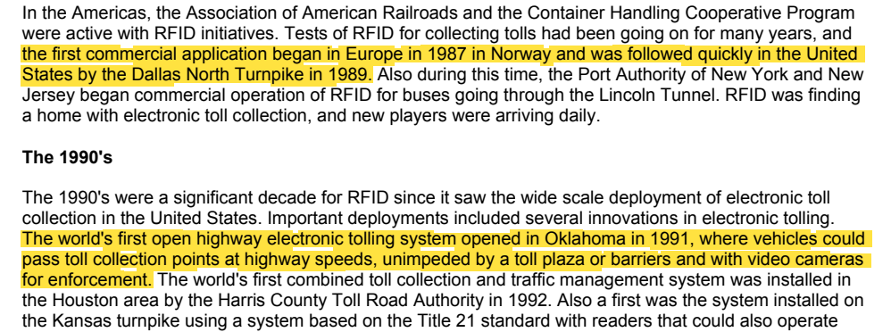
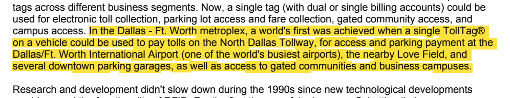
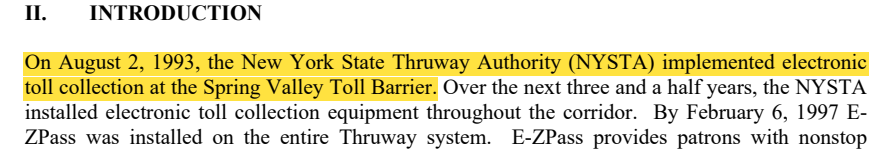
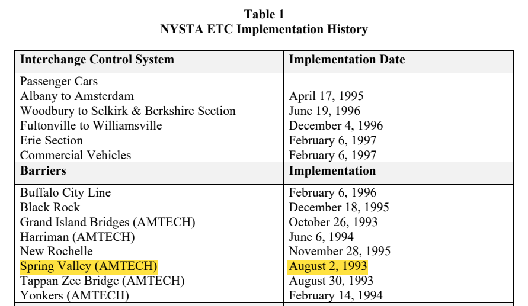
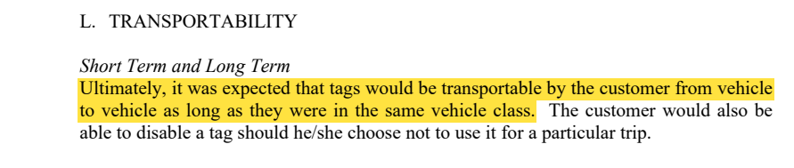
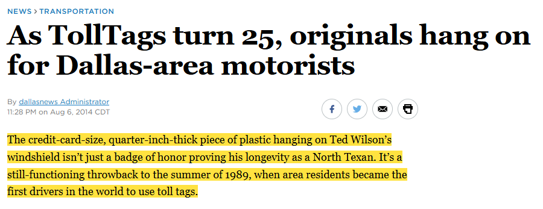
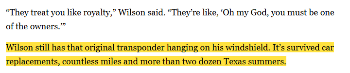
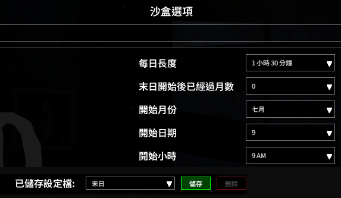

# 名稱由來與資料來源

「Knox Pass」＝遊戲舞台肯塔基州的 **Knox 郡**（Knox County）＋美國電子收費卡的命名習慣（**E-ZPass**、**TollTag**）。
遊戲內的物品用通用名稱「車用感應盒」，不用 TollTag 這個名字：它是註冊商標（下方來源 [1] 寫作 TollTag®）。

## 時間線：遊戲開局前後的電子收費

| 時間 | 事件 | 來源 |
|---|---|---|
| 1987 | 挪威啟用全世界第一個商業電子收費 | [1] 第 5 頁 |
| 1989 年夏天 | 達拉斯北收費公路（Dallas North Tollway）開始用 TollTag，當地駕駛成為全世界第一批使用收費卡的人 | [1] 第 5 頁、[3] |
| 1991 | 奧克拉荷馬啟用全世界第一條不設收費亭、用高速通過的電子收費公路 | [1] 第 5 頁 |
| 1990 年代 | 達拉斯－沃斯堡一帶，同一張 TollTag 可以付過路費、進出機場與市中心停車場，也能開門禁社區和企業園區的大門 | [1] 第 6 頁 |
| **1993-07-09** | **Project Zomboid 的預設開局日** | [4] |
| 1993-08-02 | 紐約州高速公路 Spring Valley 收費站啟用電子收費，這是 E-ZPass 的起點，在開局後第 24 天 | [2] PDF 第 7、9 頁 |

開局時，收費卡已經在達拉斯用了四年，也已經能開社區大門；24 天後紐約才啟用 E-ZPass。Knox Pass 假設 Knox 郡也趕上了這一波：郡裡發的收費卡，順便拿來開自家大門。

## 感應盒為什麼長這樣

- **信用卡大小、掛在擋風玻璃上**：1989 年第一代 TollTag 是信用卡大小、約 0.6 公分（四分之一吋）厚的塑膠盒，掛在擋風玻璃上 [3]。Knox Pass 的感應盒是 86×54 mm（信用卡尺寸）的盒子，裝上後在擋風玻璃上緣看得到。
- **換車照樣通行**：第一代 TollTag 的原始用戶，那顆收費卡跟著他換過好幾台車，二十五年後還在用 [3]；E-ZPass 當年也規劃讓收費卡在同級車輛之間帶著走 [2]。Knox Pass 的登記因此跟著感應盒走，不跟著車。

## 來源

每段引文下方附原文截圖：PDF 是原頁面裁切，新聞是網際網路檔案館存檔頁面的文字段落（不含報導照片）。黃色底色是本文引用的句子，由我們標示。

**[1]** Jeremy Landt, *Shrouds of Time: The History of RFID*, AIM Inc., 2001（TransCore 網站上的 PDF，共 11 頁）
<https://transcore.com/wp-content/uploads/2017/01/History-of-RFID-White-Paper.pdf>

> 第 5 頁：the first commercial application began in Europe in 1987 in Norway and was followed quickly in the United States by the Dallas North Turnpike in 1989.

> 第 5 頁：The world's first open highway electronic tolling system opened in Oklahoma in 1991, where vehicles could pass toll collection points at highway speeds, unimpeded by a toll plaza or barriers and with video cameras for enforcement.

> 第 6 頁：In the Dallas - Ft. Worth metroplex, a world's first was achieved when a single TollTag® on a vehicle could be used to pay tolls on the North Dallas Tollway, for access and parking payment at the Dallas/Ft. Worth International Airport (one of the world's busiest airports), the nearby Love Field, and several downtown parking garages, as well as access to gated communities and business campuses.

**[2]** Vollmer Associates LLP, *E-ZPass Evaluation Report*, prepared for New York State Thruway Authority, August 2000（美國運輸部 ROSA P 典藏，PDF 共 48 頁）
<https://rosap.ntl.bts.gov/view/dot/3157/dot_3157_DS1.pdf>
（頁碼指 PDF 的第幾頁；報告內文印的頁碼比它少 4，例如 PDF 第 7 頁印的是 3。）

> PDF 第 7 頁（報告頁碼 3）：On August 2, 1993, the New York State Thruway Authority (NYSTA) implemented electronic toll collection at the Spring Valley Toll Barrier.

> PDF 第 9 頁（報告頁碼 5，Table 1 各收費站啟用日期）：Spring Valley (AMTECH) — August 2, 1993

> PDF 第 14 頁（報告頁碼 10）：Ultimately, it was expected that tags would be transportable by the customer from vehicle to vehicle as long as they were in the same vehicle class.

**[3]** "As TollTags turn 25, originals hang on for Dallas-area motorists", *The Dallas Morning News*, 2014-08-06（網頁標示美國中部時間晚上 11:28；網址裡的日期是 2014/08/07）
<https://www.dallasnews.com/news/transportation/2014/08/07/as-tolltags-turn-25-originals-hang-on-for-dallas-area-motorists/>
（原站有付費牆與機器人檢查；網際網路檔案館的存檔：<https://web.archive.org/web/20230320023727/https://www.dallasnews.com/news/transportation/2014/08/07/as-tolltags-turn-25-originals-hang-on-for-dallas-area-motorists/>）

> The credit-card-size, quarter-inch-thick piece of plastic hanging on Ted Wilson's windshield isn't just a badge of honor proving his longevity as a North Texan. It's a still-functioning throwback to the summer of 1989, when area residents became the first drivers in the world to use toll tags.

> Wilson still has that original transponder hanging on his windshield. It's survived car replacements, countless miles and more than two dozen Texas summers.

**[4]** Project Zomboid 42.21 的開局設定。新遊戲選「自訂沙盒」、設定檔選「末日」時，沙盒選項「時間」頁的開始月份是七月、開始日期是 9（下圖）。同一組值寫在原版檔案 `media/lua/shared/Sandbox/Apocalypse.lua`：`StartYear = 1`、`StartMonth = 7`、`StartDay = 9`。年份不在選項裡顯示，遊戲把它換算成 1993＋StartYear−1（反編譯 `zombie/SandboxOptions.java` 的 `applySettings` 與 `getFirstYear`），所以開局是 1993 年 7 月 9 日。爆發、復興、絕滅三個設定檔也是 7 月 9 日。

（遊戲內截圖。上下兩段取自同一個畫面：上方是「時間」頁，下方是畫面底部的設定檔選單，中間的空白已裁掉。）
